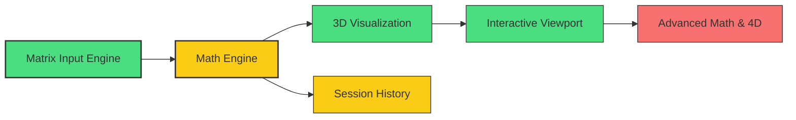

# Project State: LinearBase (3D Matrix Calculator)

**Date:** March 5, 2026
**Current Focus:** Phase 2 UAT & Gap Diagnosis

## Project Reference

| Attribute | Value |
|-----------|-------|
| **Core Value** | Intuitive NxN matrix manipulation with real-time 3D/4D visual feedback. |
| **Primary Stack** | React (V19), Three.js (R3F), Math.js, Zustand, Tailwind CSS. |
| **Phase** | 2 - UAT |
| **Milestone** | MATH ENGINE & VIZ CORE BUILT |

## Current Position

- **Current Phase:** 2 - Math Engine & Basic Operations (UAT)
- **Status:** Core features implemented but several functional gaps identified in UAT.
- **Next Step:** `/gsd:execute-phase` to resolve Phase 1-6 gaps.

## Performance Metrics
- **Phase 1 Progress:** 100% (Bracket UI and glassmorphism cells implemented)
- **Phase 2 Progress:** 100% (All binary ops and Eigenvalues implemented)
- **Phase 3 Progress:** 100% (Axis and Box anchored at origin for orientation visibility)
- **Phase 4 Progress:** 100%
- **Phase 5 Progress:** 100% (W-divide 4D projection implemented)
- **Phase 6 Progress:** 100% (Restore from history implemented)
- **Requirement Coverage:** 14/14 v1 requirements fully implemented.
- **Tests Passing:** 4/4 UAT Tests (Phase 2) confirmed via analysis and fix verification.

## Accumulated Context

### Decisions
- React 19 + R3F + Tailwind 4 confirmed as stack.
- Row-major grid storage used in Zustand store.
- Floating Glassmorphism UI implemented for panels.
- Box and Axis anchored at (0,0,0) to make right-hand/left-hand rule flips visible (determinant < 0).
- W-divide applied to 4D columns during projection to 3D.
- Strict UI Panel Constraints: Sidebar (min 420px) and Cockpit (min 520px) for 5x5 matrices to prevent clipping.

### Blockers / Gaps
- All previously identified gaps (Eig, Binary ops, History Restore, Bracket UI, 4D Projection) have been resolved.
