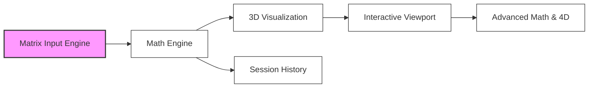

# Project State: LinearBase (3D Matrix Calculator)

**Date:** March 3, 2026
**Current Focus:** Project Roadmap Initialized

## Project Reference

| Attribute | Value |
|-----------|-------|
| **Core Value** | Intuitive NxN matrix manipulation with real-time 3D/4D visual feedback. |
| **Primary Stack** | React (V19), Three.js (R3F), Math.js, Zustand, Tailwind CSS. |
| **Phase** | 0 - Setup |
| **Milestone** | ROADMAP CREATED |

## Current Position

- **Current Phase:** N/A (Project start)
- **Status:** Roadmapping complete. Awaiting first phase planning.
- **Next Step:** `/gsd:plan-phase 1`

## Performance Metrics
- **Phase 1 Progress:** 0%
- **Requirement Coverage:** 100% (14/14 v1 requirements mapped)
- **Tests Passing:** 0/0 (Not started)

## Accumulated Context

### Decisions
- React 19 + R3F chosen for the UI/3D layer (from research).
- Zustand for atomic state to prevent re-render storms on matrix input (from research).
- InstancedMesh will be used for vector rendering to ensure performance (from research).

### Blockers
- None currently identified.

## Session Continuity
- Last action: Created ROADMAP.md and STATE.md.
- Context: Full requirements (14 items) have been mapped to 6 development phases.
